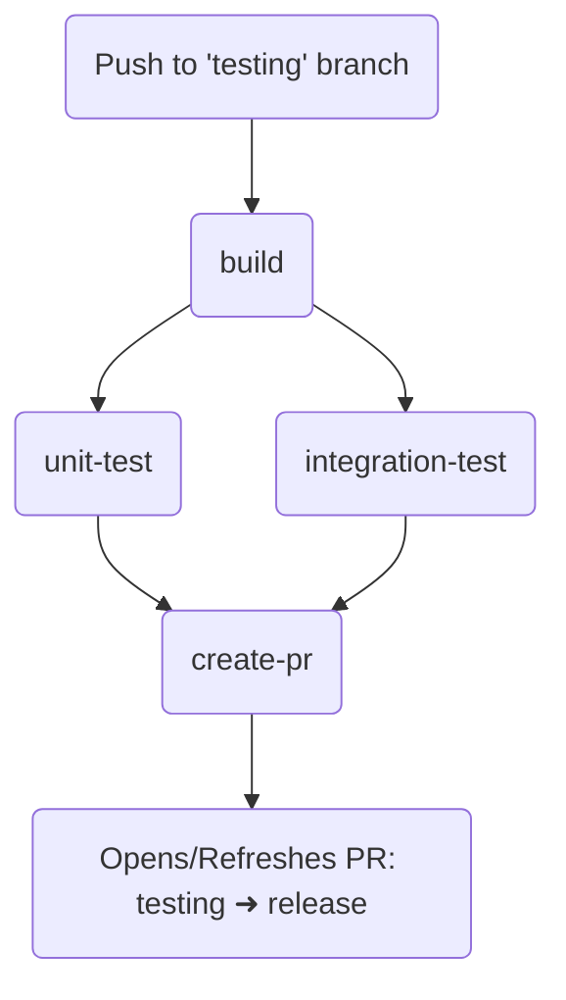

# 🚀 GitHub Actions: CI/CD Pipeline Guide

A hands-on walkthrough for building a complete CI/CD pipeline — from a simple "Hello World" job to a full build → test → PR automation flow.

---

## 📋 Table of Contents

1. [Triggering a Workflow](#1-triggering-a-workflow)
2. [Printing & Debugging](#2-printing--debugging)
3. [Building a Node.js Project](#3-building-a-nodejs-project)
4. [Pinning Node Version & Caching npm](#4-pinning-node-version--caching-npm)
5. [Caching the Next.js Build](#5-caching-the-nextjs-build)
6. [Uploading Build Artifacts](#6-uploading-build-artifacts)
7. [Running Unit & Integration Tests](#7-running-unit--integration-tests)
8. [Auto-Creating a Pull Request](#8-auto-creating-a-pull-request)
9. [Attaching Test Summaries to the PR](#9-attaching-test-summaries-to-the-pr)

---

## 1. Triggering a Workflow

Every workflow starts with a name and a trigger. This one runs whenever someone pushes to the `testing` branch.

```yaml
name: Examples

on:
  push:
    branches: [ testing ]
```

> [!TIP]
> **Why this matters:** Scoping `on.push.branches` keeps the workflow from firing on every branch — useful when `testing` is your integration branch before merging into `release`.

---

## 2. Printing & Debugging

A simple job that prints output and demonstrates GitHub's special debug logging.

```yaml
jobs:
  example:
    runs-on: ubuntu-latest
    steps:
      - name: Print
        run: echo "Hello World"

      - name: Print (debug)
        run: echo "::debug::This is a debug message"

      - name: Print repo details
        run: |
          echo "Owner: ${{ github.repository_owner }}"
          echo "Repo: ${{ github.event.repository.name }}"
          echo "Event: ${{ github.event_name }}"
          echo "Branch: ${{ github.ref }}"
          echo "Actor: ${{ github.actor }}"
          echo "SHA: ${{ github.sha }}"
```


> [!NOTE]
> **About `::debug::`:** This is a [workflow command](https://docs.github.com/en/actions/using-workflows/workflow-commands-for-github-actions). Debug messages are hidden by default and only appear in logs when you enable **debug logging** (set the `ACTIONS_STEP_DEBUG` secret to `true`).

---

## 3. Building a Node.js Project

```yaml
jobs:
  example:
    runs-on: ubuntu-latest
    steps:
      - name: Checkout repository
        uses: actions/checkout@v4

      - name: Set up Node.js
        uses: actions/setup-node@v6

      - name: Install dependencies
        run: npm ci

      - name: Build project
        run: npm run build
        env:
          ENCRYPTION_KEY: ${{ secrets.ENCRYPTION_KEY }}

      - name: Test build
        run: npm run test
```

### 🔍 What these actions actually do

| Action | Purpose |
|---|---|
| **`actions/checkout@v4`** | Clones your repository's code onto the runner. Without this step, the runner is an empty Ubuntu VM with no access to your source code — every workflow that touches your code needs it first. |
| **`actions/setup-node@v6`** | Installs a specific Node.js version on the runner and configures the `npm`/`yarn`/`pnpm` cache. It also adds Node to the `PATH` so subsequent steps can run `npm`, `node`, etc. |

> [!TIP]
> **`npm ci` vs `npm install`:** Use `npm ci` in CI pipelines. It installs exact versions from `package-lock.json`, deletes `node_modules` first for a clean slate, and fails if the lockfile is out of sync — making builds reproducible and catching dependency drift early.

---

## 4. Pinning Node Version & Caching npm

```yaml
      - name: Set up Node.js
        uses: actions/setup-node@v6
        with:
          node-version: '22'
          cache: 'npm'
```

> [!IMPORTANT]
> **Why pin the version?** Letting Node default to "whatever's latest" means your build can silently break when a new major version ships. Pinning `node-version: '22'` keeps local, CI, and production environments consistent.

> [!TIP]
> **The `cache: 'npm'` option** automatically caches `~/.npm` based on your lockfile hash — no need to manually configure `actions/cache` for dependencies.

---

## 5. Caching the Next.js Build

Speeds up rebuilds by reusing `.next/cache` between runs, keyed on dependencies and source files.

```yaml
      - name: Cache Next.js build
        uses: actions/cache@v6
        with:
          path: .next/cache
          key: ${{ runner.os }}-nextjs-${{ hashFiles('**/package-lock.json') }}-${{ hashFiles('**/*.ts', '**/*.tsx', '**/*.js', '**/*.jsx', '!**/node_modules/**') }}
          restore-keys: |
            ${{ runner.os }}-nextjs-${{ hashFiles('**/package-lock.json') }}-
            ${{ runner.os }}-nextjs-
```

> [!NOTE]
> **How cache keys work:** GitHub looks for an *exact* match on `key` first. If none exists, it falls back through `restore-keys` in order, using the most recent partial match — so even if your source files changed, you still get a "warm" cache based on matching dependencies.

---

## 6. Uploading Build Artifacts

Artifacts let one job hand off files to another job (or let a human download them from the Actions UI).

```yaml
      - name: Upload build artifact
        uses: actions/upload-artifact@v6
        with:
          name: next-build
          path: .next
          include-hidden-files: true
          retention-days: 1
```

> [!TIP]
> **`retention-days: 1`** keeps storage costs down — set this low for short-lived CI artifacts, and higher only for build outputs you actually want to keep around (e.g. release binaries).

---

## 7. Running Unit & Integration Tests

Test jobs run **in parallel** with each other, but both depend on the `build` job finishing first via `needs: build`.

```yaml
  unit-test:
    runs-on: ubuntu-latest
    needs: build
    steps:
      - name: Checkout repository
        uses: actions/checkout@v6

      - name: Set up Node.js
        uses: actions/setup-node@v6
        with:
          node-version: '22'
          cache: 'npm'

      - name: Install dependencies
        run: npm ci

      - name: Download build artifact
        uses: actions/download-artifact@v4
        with:
          name: next-build
          path: .next

      - name: Run unit tests
        run: npm run test:unit
        env:
          ENCRYPTION_KEY: ${{ secrets.ENCRYPTION_KEY }}

  integration-test:
    runs-on: ubuntu-latest
    needs: build
    steps:
      - name: Checkout repository
        uses: actions/checkout@v6

      - name: Set up Node.js
        uses: actions/setup-node@v6
        with:
          node-version: '22'
          cache: 'npm'

      - name: Install dependencies
        run: npm ci

      - name: Download build artifact
        uses: actions/download-artifact@v4
        with:
          name: next-build
          path: .next

      - name: Run integration tests
        run: npm run test:integration
        env:
          ENCRYPTION_KEY: ${{ secrets.ENCRYPTION_KEY }}
```

> [!WARNING]
> **Why `needs: build` is essential:** Without it, GitHub Actions runs all jobs in parallel by default. Both test jobs would start *before* the `build` job finishes, then fail at `download-artifact` because the `next-build` artifact wouldn't exist yet. `needs` enforces the correct execution order: **build → (unit-test ‖ integration-test)**.

---

## 8. Auto-Creating a Pull Request

Once both test jobs pass, automatically open (or refresh) a PR from `testing` into `release`.

```yaml
  create-pr:
    runs-on: ubuntu-latest
    needs: [integration-test, unit-test]
    if: github.ref == 'refs/heads/testing'

    steps:
      - name: Create Pull Request
        uses: actions/github-script@v7
        with:
          script: |
            // Find existing PR from testing -> release
            const { data: openPrs } = await github.rest.pulls.list({
              owner: context.repo.owner,
              repo: context.repo.repo,
              base: 'release',
              state: 'open'
            });

            const existingPr = openPrs.find(pr => pr.head.ref === 'testing');

            if (existingPr) {
              console.log(`Closing existing PR #${existingPr.number}...`);

              await github.rest.pulls.update({
                owner: context.repo.owner,
                repo: context.repo.repo,
                pull_number: existingPr.number,
                state: 'closed'
              });
            }

            console.log('Creating new Pull Request...');

            await github.rest.pulls.create({
              owner: context.repo.owner,
              repo: context.repo.repo,
              title: '[Test Workflow] Unit and integration tests completed successfully',
              head: 'testing',
              base: 'release',
              body: [
                'This PR was created automatically after:',
                '- Unit tests passed',
                '- Integration tests passed'
              ].join('\n')
            });
```

> [!NOTE]
> **`actions/github-script@v7`** gives you an authenticated, pre-configured Octokit client (`github`) inside the `script:` block, so you can call the GitHub REST API directly in JavaScript without manually handling auth tokens.

> [!WARNING]
> **Logic note:** This closes the existing PR and opens a brand-new one each run, which loses PR comments/review history and reassigns a new PR number. If you just want to *refresh* the same PR, consider using `pulls.update()` on the existing PR's body/title instead of closing + recreating.

---

## 9. Attaching Test Summaries to the PR

Capture each test job's `$GITHUB_STEP_SUMMARY` output and pass it through job outputs so the PR description includes both summaries.

Update the test steps to capture the test summary:

```yaml
  unit-test:
    runs-on: ubuntu-latest
    needs: build
    outputs:
      summary: ${{ steps.run-tests.outputs.summary }}
    steps:
      # ...checkout, setup-node, install, download-artifact (as above)...

      - name: Run unit tests
        id: run-tests
        run: |
          npm run test:unit -- --reporter=default --reporter=github-actions
          {
            echo "summary<<EOF"
            cat "$GITHUB_STEP_SUMMARY"
            echo "EOF"
          } >> "$GITHUB_OUTPUT"
        env:
          ENCRYPTION_KEY: ${{ secrets.ENCRYPTION_KEY }}
```
```yaml

  integration-test:
    runs-on: ubuntu-latest
    needs: build
    outputs:
      summary: ${{ steps.run-tests.outputs.summary }}
    steps:
      # ...checkout, setup-node, install, download-artifact (as above)...

      - name: Run integration tests
        id: run-tests
        run: |
          npm run test:integration -- --reporter=default --reporter=github-actions
          {
            echo "summary<<EOF"
            cat "$GITHUB_STEP_SUMMARY"
            echo "EOF"
          } >> "$GITHUB_OUTPUT"
        env:
          ENCRYPTION_KEY: ${{ secrets.ENCRYPTION_KEY }}
```
Update the create-pr steps to capture the test summary:

```yaml

  create-pr:
    runs-on: ubuntu-latest
    needs: [integration-test, unit-test]
    if: github.ref == 'refs/heads/testing'
    steps:
      - name: Create Pull Request
        uses: actions/github-script@v7
        env:
          UNIT_SUMMARY: ${{ needs.unit-test.outputs.summary }}
          INTEGRATION_SUMMARY: ${{ needs.integration-test.outputs.summary }}
        with:
          script: |
            const unitSummary = process.env.UNIT_SUMMARY;
            const integrationSummary = process.env.INTEGRATION_SUMMARY;

            const { data: openPrs } = await github.rest.pulls.list({
              owner: context.repo.owner,
              repo: context.repo.repo,
              base: 'release',
              state: 'open'
            });

            const existingPr = openPrs.find(pr => pr.head.ref === 'testing');
            if (existingPr) {
              console.log(`Closing existing PR #${existingPr.number} before creating a new one...`);
              await github.rest.pulls.update({
                owner: context.repo.owner,
                repo: context.repo.repo,
                pull_number: existingPr.number,
                state: 'closed'
              });
            }

            console.log('Creating new Pull Request...');
            await github.rest.pulls.create({
              owner: context.repo.owner,
              repo: context.repo.repo,
              title: `[Test Workflow] Unit and integration tests completed successfully`,
              head: 'testing',
              base: 'release',
              body: [
                'This is an automated pull request created after successful unit and integration tests.',
                '',
                '### Unit Test Summary',
                unitSummary,
                '',
                '### Integration Test Summary',
                integrationSummary
              ].join('\n')
            });
```

> [!TIP]
> **The `EOF` heredoc trick** (`echo "summary<<EOF" ... echo "EOF"`) is required because `GITHUB_OUTPUT` values are normally single-line. This delimiter syntax lets you write **multi-line** content (like a full test report) into a single output variable safely.

> [!CAUTION]
> **Watch out for the `EOF` delimiter colliding with content.** If your test summary ever contains the literal string `EOF` on its own line, this will break the output parsing. For production pipelines, use a random delimiter instead, e.g. `echo "summary<<ghadelim_$(uuidgen)"`.

---

## ✅ Final Pipeline Flow



> [!IMPORTANT]
> **Key architectural takeaway:** `needs:` is what turns a flat list of jobs into a real pipeline. Jobs without `needs` run in parallel by default — explicit dependencies are what guarantee build artifacts exist before tests run, and that tests pass before a PR is created.