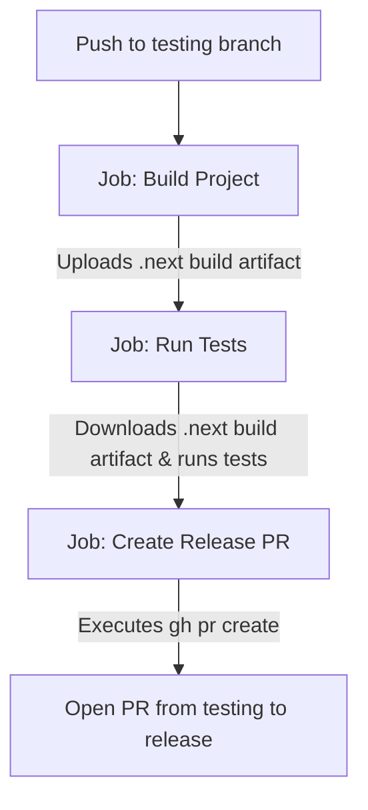

# Anonymous Feedback Platform

A highly optimized, minimalistic, and secure anonymous feedback platform built with Next.js, SQLite, and Tailwind CSS. The application is designed to handle high concurrency, secure file/image uploads, real-time UI state tracking (likes/unlikes), and robust encryption for all stored data.

---

## 1. Project Overview & Architecture

### Architectural Design
The project is built on the **Next.js App Router** architecture, leveraging a unified layout and modular backend APIs to implement a high-performance system. The core design principles are:
*   **Security First:** No authentication is required for users to submit feedback. Instead, all submitted data (names, messages, image paths) is encrypted symmetrically using AES-GCM before writing to the database.
*   **Concurrency Handling:** A built-in transactional write queue is implemented to prevent SQLite lockups (`SQLITE_BUSY` errors) under high write/concurrency load.
*   **Client-Side Reactivity:** Real-time state updates for likes, unlikes, and submissions are tracked on the client side using a unique persistent visitor session generated locally.

### Tech Stack
*   **Core:** React 19, Next.js 16 (using App Router and Turbopack compiler)
*   **Styling:** Tailwind CSS v4, PostCSS
*   **Database:** SQLite (`better-sqlite3` native driver)
*   **Testing:** Vitest
*   **CI/CD:** GitHub Actions (custom pipelines with Node 24 support)

### API Requests & Handling

All endpoints are built as Next.js route handlers under `/app/api`:

#### 1. Fetch & Submit Feedback
*   **Endpoint:** `GET /api/feedback` & `POST /api/feedback`
*   **GET Description:** Retrieves all feedbacks ordered by popularity (likes) and timestamp. It identifies if the current visitor has liked any feedback using their `visitorId` header.
*   **POST Description:** Validates incoming payloads (JSON or FormData), compresses uploaded images to under 1MB using `sharp` on the server-side, encrypts metadata, and saves to the database.

#### 2. Toggle Like/Unlike
*   **Endpoint:** `POST /api/feedback/[id]/like`
*   **Description:** Performs an atomic check-and-toggle transaction on the `likes` table. Returns the updated like count and the current like status for the caller.

#### 3. Image Server
*   **Endpoint:** `GET /api/feedback/image/[filename]`
*   **Description:** Decrypts the stored image path, securely reads the image binary from disk, and serves it back to the client with optimized caching headers.

---

## 2. Database Section

The application uses an embedded **SQLite** database, optimized for write throughput and robust concurrency.

### Database Design & Schema
```sql
CREATE TABLE IF NOT EXISTS feedbacks (
  id TEXT PRIMARY KEY,
  name TEXT,
  message TEXT NOT NULL,
  image_path TEXT,
  likes INTEGER DEFAULT 0,
  created_at DATETIME DEFAULT CURRENT_TIMESTAMP
);

CREATE TABLE IF NOT EXISTS likes (
  id TEXT PRIMARY KEY,
  feedback_id TEXT NOT NULL,
  visitor_id TEXT NOT NULL,
  created_at DATETIME DEFAULT CURRENT_TIMESTAMP,
  UNIQUE(feedback_id, visitor_id),
  FOREIGN KEY(feedback_id) REFERENCES feedbacks(id) ON DELETE CASCADE
);
```

### Optimizations
*   **WAL Mode (Write-Ahead Logging):** Configured via `db.pragma('journal_mode = WAL')` to allow concurrent reads even while writes are occurring.
*   **Database Indexes:**
    *   `idx_feedbacks_likes` on `feedbacks(likes DESC)` to accelerate sorted homepage rendering.
    *   `idx_likes_lookup` on `likes(feedback_id, visitor_id)` to speed up visitor-like checks.
*   **Write Queue:** A custom in-memory serialized `WriteQueue` queueing class queues all `INSERT`/`UPDATE` operations sequentially, preventing sqlite database lock errors during heavy traffic spikes.

---

## 3. Testing Section

Unit and integration tests are powered by **Vitest**.

### Test Suite Structure
*   `__tests__/crypto.test.ts`: Validates that plaintext data is correctly encrypted with AES-256-GCM and decrypts cleanly to match the original input. It also verifies that invalid/missing keys throw appropriate errors.
*   `__tests__/db.test.ts`: Tests the database driver logic including creating feedback records, managing transactions, toggling likes, and checking WAL configuration.

### Running Tests Locally
To run the test suite locally:
```bash
# Run tests once
npm run test

# Run tests in watch mode
npx vitest
```

---

## 4. GitHub Actions CI/CD Pipeline (testing.yml)

The pipeline is defined in `.github/workflows/testing.yml` and is designed as a single, unified, job-dependent pipeline.



### Sequential Job Architecture
Instead of running separate workflows that trigger asynchronously on `workflow_run`, we unified all steps into a single workflow. 
*   **Why we did this:** Asynchronous workflows are hard to debug, run out of checkout contexts, and make tracking progress difficult. A single pipeline allows you to see the step-by-step progress of your commit directly on the commit status page.

---

## 5. GitHub Actions - Section by Section Code Breakdown

Below is a detailed breakdown of the workflow configuration and the design rationale behind each section:

### Workflow Trigger
```yaml
on:
  push:
    branches: [ testing ]
```
*   **Why we did this:** The `testing` branch acts as the final gatekeeper before production. We only run this comprehensive build-test-PR pipeline when code is explicitly pushed to `testing`. This prevents consuming GitHub Actions runner minutes on unstable development (`dev`) pushes.

---

### Job 1: Build Project (`build`)
This job builds the application and verifies compilation.
```yaml
jobs:
  build:
    name: Build Project
    runs-on: ubuntu-latest
```

#### Step: Checkout Repository
```yaml
      - name: Checkout repository
        uses: actions/checkout@v7
```
*   **Why we did this:** Fetches the code from the repository. We use the latest `v7` version to ensure modern runtime support and security hardening patches.

#### Step: Setup Node.js
```yaml
      - name: Set up Node.js
        uses: actions/setup-node@v6
        with:
          node-version: '24'
          cache: 'npm'
```
*   **Why we did this:** Sets up Node.js. Using the latest major action tag (`v6`) and targeting **Node 24** ensures compatability with Next.js compilation, and matches our local development environment. Caching is enabled natively to speed up dependency lookup.

#### Step: Cache Node Modules
```yaml
      - name: Cache node modules
        id: cache-npm
        uses: actions/cache@v6
        with:
          path: node_modules
          key: ${{ runner.os }}-node-${{ hashFiles('**/package-lock.json') }}
```
*   **Why we did this:** Reusing cached `node_modules` across runs cuts the workflow duration by up to 80% because it skips executing `npm install` from scratch if dependencies haven't changed.
*   **Key Expressions Explained:**
    *   **`id: cache-npm`**: <span style="font-size: 1.1em;">We assign an identifier to this step so that subsequent steps can query its outcome (e.g. check if the cache was found).</span>
    *   **`${{ runner.os }}`**: <span style="font-size: 1.1em;">A GitHub Actions context variable that resolves to the runner's operating system (e.g. `Linux`). We include this in the key so that if the runner OS changes, we don't accidentally load incompatible binary dependencies.</span>
    *   **`${{ hashFiles('**/package-lock.json') }}`**: <span style="font-size: 1.1em;">A built-in GitHub Actions function that calculates a unique cryptographic SHA-256 hash of the `package-lock.json` file. If you add or update any packages, the lockfile changes, which changes this hash. This invalidates the old cache key and forces the pipeline to download the fresh packages.</span>

#### Step: Install Dependencies
```yaml
      - name: Install dependencies
        if: steps.cache-npm.outputs.cache-hit != 'true'
        run: npm ci
```
*   **Why we did this:** Runs `npm ci` (clean install) only if there is a cache miss. This ensures deterministic builds.
*   **Key Expressions Explained:**
    *   **`if: steps.cache-npm.outputs.cache-hit != 'true'`**: <span style="font-size: 1.1em;">A conditional expression. It checks the output of the step named `cache-npm`. If the output variable `cache-hit` is not equal to `'true'` (meaning the dependencies were not found in the cache), the installation command is executed. Otherwise, it is skipped entirely.</span>
    *   **`npm ci`**: <span style="font-size: 1.1em;">Instead of `npm install`, `npm ci` is designed specifically for automated environments. It is faster, stricter, and throws an error if the `package-lock.json` is out of sync with `package.json`, ensuring absolute build reproducibility.</span>

#### Step: Next.js Build Cache
```yaml
      - name: Setup Next.js build cache
        uses: actions/cache@v6
        with:
          path: ${{ github.workspace }}/.next/cache
          key: ${{ runner.os }}-next-${{ hashFiles('**/package-lock.json') }}-${{ hashFiles('**/*.js', '**/*.jsx', '**/*.ts', '**/*.tsx') }}
          restore-keys: |
            ${{ runner.os }}-next-${{ hashFiles('**/package-lock.json') }}-
```
*   **Why we did this:** Next.js uses an incremental cache for build outputs. Persisting `.next/cache` between runs drastically speeds up compilation times.
*   **Key Expressions Explained:**
    *   **`${{ github.workspace }}`**: <span style="font-size: 1.1em;">Resolves to the absolute workspace path where the repository is checked out on the virtual machine runner.</span>
    *   **`restore-keys`**: <span style="font-size: 1.1em;">Fallback cache keys. If the exact cache key (which includes hashes of all source code files) is not found, GitHub Actions will fall back to using the most recent cache matching the prefix specified in `restore-keys`. This allows Next.js to reuse partial compilation state even if the source code changed.</span>

#### Step: Build Project
```yaml
      - name: Build project
        run: npm run build
        env:
          ENCRYPTION_KEY: ${{ secrets.ENCRYPTION_KEY }}
```
*   **Why we did this:** Compiles the application into static routes and optimized server scripts. Since the build process typechecks and lints the code, it acts as a primary check to catch compilation issues before any testing.
*   **Key Expressions Explained:**
    *   **`${{ secrets.ENCRYPTION_KEY }}`**: <span style="font-size: 1.1em;">Safely retrieves the encryption secret configured in the repository's GitHub Actions secrets panel (`Settings -> Secrets and variables -> Actions`). This allows Next.js to access this key during static page generation and server builds without exposing the key in the source code.</span>

#### Step: Upload Build Artifact
```yaml
      - name: Upload build artifact
        uses: actions/upload-artifact@v7
        with:
          name: next-build
          path: .next
          include-hidden-files: true
          retention-days: 1
```
*   **Why we did this:** To satisfy the requirement of running tests against the **exact same build**, we upload the compiled `.next` folder as a pipeline artifact. We explicitly set `include-hidden-files: true` because `.next` starts with a dot, and by default GitHub Actions excludes dotfolders. We set `retention-days: 1` to clean up disk storage immediately.

---

### Job 2: Run Tests (`test`)
This job runs the unit and integration test suites.
```yaml
  test:
    name: Run Tests
    needs: build
    runs-on: ubuntu-latest
```
*   **Why we did this:**
    *   `needs: build`: A dependency constraint. It ensures the `test` job only runs if the `build` job completes successfully. If compilation fails, testing is skipped, saving build minutes.
    *   `runs-on: ubuntu-latest`: Specifies that the job should run on a virtual machine pre-configured with the latest stable Ubuntu operating system.

#### Step: Download Build Artifact
```yaml
      - name: Download build artifact
        uses: actions/download-artifact@v8
        with:
          name: next-build
          path: .next
```
*   **Why we did this:** Downloads the `.next` compilation folder generated by the `build` job. This guarantees that the test suite runs alongside the exact assets destined for deployment.

#### Step: Run Unit Tests
```yaml
      - name: Run unit tests
        run: npm run test
        env:
          ENCRYPTION_KEY: ${{ secrets.ENCRYPTION_KEY }}
```
*   **Why we did this:** Runs Vitest unit tests. We inject `ENCRYPTION_KEY` from the GitHub Secrets repository store so the crypto module can run tests against the database encryption/decryption utilities.

---

### Job 3: Create Release PR (`create-pr`)
Automates pull request generation.
```yaml
  create-pr:
    name: Create Release PR
    needs: [build, test]
    runs-on: ubuntu-latest
    permissions:
      pull-requests: write
      contents: write
```
*   **Why we did this:**
    *   `needs: [build, test]`: Ensures this job only runs if both building and testing complete successfully.
    *   `permissions`: Defines the security clearance of the temporary `GITHUB_TOKEN` issued for the job. We request `pull-requests: write` to open a PR, and `contents: write` to update repository branches.

#### Step: Create Pull Request
```yaml
      - name: Create Pull Request to Release
        run: |
          PR_EXISTS=$(gh pr list --head testing --base release --json number --jq '.[0].number')
          if [ -n "$PR_EXISTS" ]; then
            echo "PR already exists: #$PR_EXISTS. Skipping."
          else
            gh pr create \
              --title "release: merge testing into release" \
              --body "Automated release PR created after successful build and test pipeline on testing branch." \
              --base release \
              --head testing
          fi
        env:
          GITHUB_TOKEN: ${{ secrets.GITHUB_TOKEN }}
```
*   **Why we did this:** Instead of using third-party workflow actions that require custom access tokens, we use the pre-installed GitHub CLI (`gh`). The script first checks if an open PR already exists from `testing` to `release` to avoid duplicate requests. If none exists, it opens a clean release PR automatically.
*   **Key Expressions Explained:**
    *   **`gh pr list --head testing --base release --json number --jq '.[0].number'`**: <span style="font-size: 1.1em;">Uses the GitHub CLI to list open pull requests from the `testing` branch to the `release` branch. The output is filtered down to the JSON field `number` and queried using `jq` to select the number of the first matching PR. If a PR exists, it resolves to its number; otherwise, it resolves to an empty string.</span>
    *   **`GITHUB_TOKEN: ${{ secrets.GITHUB_TOKEN }}`**: <span style="font-size: 1.1em;">The default auth token generated by GitHub for the run. This is passed into the environment of the GitHub CLI (`gh`) to authenticate the API request for creating the PR.</span>

---

## 6. Branching Strategy

The repository follows a clean branch workflow to transition features safely:

*   `dev`: The active development branch. All developer commits are initially pushed here or merged via feature branches.
*   `testing`: The pre-release staging branch. Pushes to this branch trigger the automated CI/CD pipeline, building the application and running tests against the production build.
*   `release`: The production-ready branch. Pull requests target this branch from `testing` automatically upon pipeline success.
*   `main`: The principal branch representing the current stable deployment.
